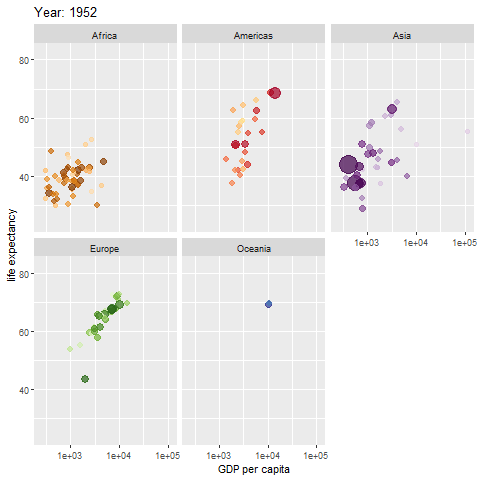
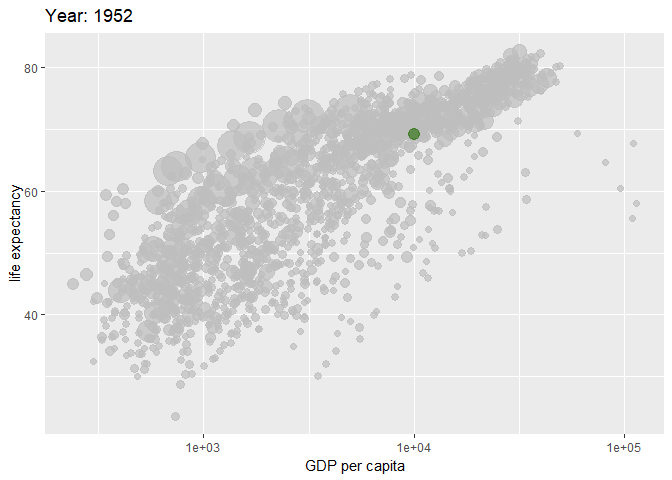

This is an R markdown document. It combines text and code so that you can write
reports, dashboards, slidedecks etc. They are also really useful for 
capturing the analytical thought process behind your work.

Change where it says `author:` above to your own name 

## Gapminder
Here's a visualization of the Gapminder data that the Swedish statistician
and sword-swallower Hans Rosling made famous in a beautiful data visualisation
showing how country's GDP per capita and life expectancy were related as a 
function of time (https://www.youtube.com/watch?v=jbkSRLYSojo).
He showed that generally countries are improving, but
notably that the African and Asian continents were catching up with the so-called
"developed" countries.

Click on the green arrows to the right of the shaded boxes to run the code and
produce the Gapminder graphic (it takes a moment or two for the code  to run).

```{r setup, echo=FALSE, message=FALSE, warning=FALSE, results="hide"}
library(tidyverse)
library(gapminder)
library(gganimate)
```


```{r, message=FALSE, results="hide", cache=TRUE, eval=FALSE}
## Code courtesy of Thomas Lin Pedersen
## https://gist.github.com/thomasp85/05169ad44ddcc8ed56da6ff7bf7fbe36

myGapminderPlot <- gapminder %>%
  ggplot( aes(gdpPercap, lifeExp, size = pop, colour = country)) +
  geom_point(alpha = 0.7, show.legend = FALSE) +
  scale_colour_manual(values = country_colors) +
  scale_size(range = c(2, 12)) +
  scale_x_log10() +
  facet_wrap(~continent) +
  # Here comes the gganimate specific bits
  labs(title = 'Year: {frame_time}', x = 'GDP per capita', y = 'life expectancy') +
  transition_time(year) +
  ease_aes('linear')

anim_save("myGapminderPlot.gif", myGapminderPlot)
```

### All countries
```{r, echo = FALSE}

```

### Comparing countries

We can repeat this visualisation and pick out the results for a single, given
country and compare with the others using the following code.

In R we assign values to objects using the `<-` character, so
  
`objectName <- value`
  
The `<-` symbol can be read (say it in your head) as "gets" or alternatively
(from right to left) `value` "is assigned to" `objectName`.

The `<-` symbol is a legacy from programming languages (and hardware!)... 
It *is* possible to use `=`, but I suggest you *don't*, for sake of clarity and 
consistency. I'll discuss why over coffee... 

Anyway, change the code below where it says `myCountry <- "United Kingdom"` to select 
one of the countries listed below:  
  
  `r glue::glue_collapse(sort(unique(as.character(gapminder::gapminder$country))), sep = ", ")`
  
***WATCH OUT*** for spelling, and note that R is case-sensitive, so that "United Kingdom"
is not the same as "united kingdom".

If you're feeling adventurous, you could provide more than one country. To do
this, use the `c( )` function to provide the names of more than one country. 
Separate countries using a comma, and don't forget to put the country names in
double quotes.

```{r, message=FALSE, warning=FALSE, results="hide", cache=TRUE}
library(gghighlight)

myCountry <- "United Kingdom"

myGapminderPlot2 <- gapminder %>%
  ggplot( aes(gdpPercap, lifeExp, size = pop, colour = country)) +
  geom_point(alpha = 0.7, show.legend = FALSE) +
  scale_colour_manual(values = country_colors) +
  scale_size(range = c(2, 12)) +
  scale_x_log10() +
  # Here comes the gganimate specific bits
  labs(title = 'Year: {frame_time}', x = 'GDP per capita', y = 'life expectancy') +
  transition_time(year) +
  ease_aes('linear') +
  # Here we select the country to highlight
  gghighlight(country %in% myCountry, use_direct_label = FALSE)

anim_save("myGapminderPlot2.gif", myGapminderPlot2)
```

```{r, echo = FALSE}

```

