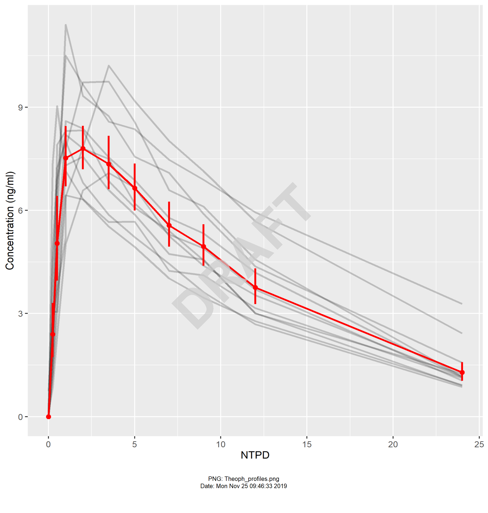

```{r setup}
library(tidyverse)
knitr::opts_chunk$set(message = FALSE, warning = FALSE)
```

## Aims
One of the great strengths of the R developer community is that developers
contribute to and extend functionality of existing packages. There is a 
growing number of extension packages that uses `ggplot2` principles, objects and
builds on this, extending and enhancing the functionality of that package.

This document highlights some that I personally find useful. I'm not presenting
an exhaustive list, nor ALL of the functionality within each, but rather 
highlighting particular functions or functionality that illustrates what the
package can do for you.

## Resources & background reading
Start with "R for Data Science" section on Data Visualization using `ggplot2`.
https://r4ds.had.co.nz/data-visualisation.html 

Then I can heartily recommend Claus O. Wilke's "Fundamentals of Data 
Visualization". https://serialmentor.com/dataviz/ This book gives good 
advice on how you should represent different data types, but also gives some
good practice on making your visualizations easier and quicker for others
to understand and digest the relevant information.
 
Finally check out https://www.ggplot2-exts.org/ for a good review of ggplot2 
extensions.

# ggplot2 tips and tricks

## Creating `ggplot2` plots for use in examples

```{r create_ggplot2_plots}
plot1 <- mpg %>%
  ggplot(mapping = aes(x = displ, y = hwy)) + 
  geom_point() + 
  geom_smooth()

plot1

plot3 <- ggplot(data=mpg, mapping=aes(x = class, y = hwy)) +
  geom_boxplot()
plot3

plot4 <- ggplot(mpg) + 
  geom_bar(aes(class,fill=class)) 
plot4
```

### ggplot2 - Add titles, subtitles, captions, axes labels
One of the great things about `ggplot2` is the way that you can create 
graphs quickly for your own use (to visualize data), but then you can take 
that object and refine it ready for presentation or publication. Here we add
labels and titles to an existing plot.

```{r annotate_ggplot2_with_labels}
plot1 +
  labs(title = "Highway mileage is inversely related to engine size",
       subtitle = "Data: mpg",
       x = "Engine size (L)",
       y = "Highway mileage (mpg)",
       caption = "Source: https://github.com/MikeKSmith/master_the_tidyverse_2019_4Q")
```


### ggplot2 - Using `%+%` to change the dataset
One often overlooked functionality in `ggplot2` is the ability to change the 
dataset within the `ggplot2` object and essentially replay the same graph for
new data. This functionality is really useful if you have draft data which you
can use to create early visualizations which you might want to refine later with
the final data. The assumption here is that variable names won't change, since 
the `mapping` to `aes`thetics is carried over. 

In the case below, we have to slightly change variable names in the `mtcars` 
dataset to get it to match the `mpg` data. But once we've done that we can
simply update `plot1` with the new data.

```{r change_ggplot2_data}
mtcars2 <- mtcars %>%
  rename(hwy = mpg,
         displ = disp)

plot2 <- plot1 %+%
  mtcars2
plot2
```

### Use forcats library functions to sort factors by size of some variable
```{r sort_categories_using_forcats}
plot5 <- mpg %>%
  group_by(class) %>%
  summarise(n = n()) %>%
  mutate(class = fct_reorder(class, n)) %>%
  ggplot(mapping = aes(x = class,fill=class)) + 
  geom_col(mapping = aes(y = n)) +
  coord_flip()
plot5
```


## patchwork - arrange multiple plots
The `patchwork` package (by Thomas Lin Pedersen - https://patchwork.data-imaginist.com/)
allows the user to define how to combine graphs. The `+` operator here combines
plots into a single plot object. `plot_annotation` then allows us to define
overarching titles, labels, annotations. `tag_levels` defines how you might 
want to identify the graphs and `tag_suffix` pastes onto the end of `tag_level`.

```{r patchwork_multiple_graphs1}
library(patchwork)
plot3 + plot4 + plot_annotation(title = "mpg data exploration", 
                                tag_levels="a", tag_suffix = ")")
```

## ggeasy - easy access to theme aspects

The x-axis `class` variable names above look AWFUL when the plots are pulled
into `patchwork`. I know that in `ggplot2` I can rotate the axes labels... but
can I recall the specific theme settings?

The `ggeasy` package (by Jonathan Carroll - https://jonocarroll.github.io/ggeasy/)
provides quick access to tweak commonly used `ggplot2` theme settings.

```{r ggeasy_peasy}
library(ggeasy)
plot3b <- plot3 +
  easy_rotate_x_labels(side = "right")
plot4b <- plot4 +
  easy_rotate_x_labels(side = "right")

plot3b + plot4b + plot_annotation(title = "mpg data exploration", 
                                tag_levels="a", tag_suffix = ")")
```


## patchwork continued - Combining many plots
Here we're using patchwork to produce a slightly more complex layout,
combining `plot3` and `plot4` in one row, then `plot1` underneath. The `-`
signifies that the combined `plot3 + plot4` are on the same level as `plot1`, 
and `plot_layout` defines that there is one column. 

```{r patchwork_multiple_graphs2}
plot3b + plot4b - plot1 + plot_layout(ncol=1) + plot_annotation(title = "mpg data exploration", 
                                                              tag_levels="i", tag_suffix = ")")
```

### Use Data Visualization best practice
In the combined graph of `plot3 + plot4` above, there is a lot of repeated 
information in the graphic (vehicle class, legends etc.). By flipping the 
plot to be horizontal, we can show the boxplot with the bar chart and
eliminate much of the redundant information.

Here we're also using the `ggeasy` functions `easy_remove_legend()` and 
`easy_remove_y_axis()` to remove the extraneous information from `plot4c`.

```{r patchwork_multiple_graphs3}
plot3c <- plot3 + coord_flip()
plot4c <- plot4 + coord_flip() + 
  easy_remove_legend() + 
  easy_remove_y_axis()

plot3c + plot4c
```


## cowplot - templates for publication ready plots
The `cowplot` package (by Claus O. Wilke - https://wilkelab.org/cowplot/index.html)
implements many of the standards and recommendations from his "Fundamentals of
Data Visualization" book. It extends `ggplot2` with themes for publication,
functions for plot alignment and additional annotations.

```{r cowplot_themes}
library(cowplot)
plot1 + 
  labs(title="Highway mileage is inversely related to engine size", 
       x = "Engine displacement (Litres)",
       y = "Highway mileage (mpg)") +
   theme_cowplot(font_size = 14)

plot1 + 
   theme_minimal_grid()

plot1 + 
   theme_minimal_hgrid()
```

### Adding annotations and text to plots
The `ggdraw` function with the `cowplot` package takes an existing `ggplot2` 
object and sets up a drawing layer for additional annotation on top. Here we're 
adding a "DRAFT" watermark.

```{r cowplot_label}
ggdraw(plot1) + 
  draw_label("Draft", color = "light grey", alpha=0.3, size = 100, angle = 45) 
```

### Using `stamp` to label plots
The `stamp` functionality allows you to label an attribute of a whole graphic.
In the book, Wilke labels plots as "ugly" or "bad", but here we're marking
the whole graph as "DRAFT". This is perhaps less obtrusive than the watermark
above.

```{r cowplot_stamp}
stamp(plot1, label = "DRAFT", color = "red")
```

## ggrepel to label points without overlap
The `ggrepel` package (by Kamil Slowikowsi - https://slowkow.com/ggrepel) has
been developed to ensure that text labels in plots do not overlap each other,
do not cover data points, nor fall outside of the plotting area. The method of 
doing so is indistinguishable from magic (or so it seems to me).

```{r ggrepel}
library(ggrepel)

plot_ugly <- ggplot(mtcars) + 
  aes(
    x = wt, y = mpg,
    label = rownames(mtcars)
  ) + 
  geom_point(color = "red") +
  geom_text()

stamp_ugly(plot_ugly)

ggplot(mtcars) + 
  aes(
    x = wt, y = mpg,
    label = rownames(mtcars)
  ) + 
  geom_point(color = "red") +
  geom_text_repel()
```


## gghighlight - highlighting visualization items based on predicates
`gghighlight` (by Hiroaki Yutani - https://yutannihilation.github.io/gghighlight/index.html)
is a `ggplot2` extension which highlights `ggplot2` `geoms` that match a given 
predicate.

In many cases this leads to the recommendations in "Fundamentals of Data
Visualization" because is allows the reader to focus straight in on the 
particular element of the plot that is key to the claims being made. It
helps the "story" of our data visualization...

```{r gghighlight_1}
library(gghighlight)

plot4 + 
  gghighlight(class == "suv")

plot1 + 
  gghighlight(class == "suv") 

plot5 + 
  gghighlight(class == "suv") +
  theme(legend.position="none")
```

## ggridges to compare densities neatly
`ggridges` (by Claus O Wilke - https://cran.r-project.org/web/packages/ggridges/vignettes/introduction.html) 
is a useful extension for plotting many densities, or other 
ridgeline visualizations where you may wish to plot the ridges by a categorical 
variable. `ggridges` stacks these plots so that the individual ridges or densities
are easily visible, but compactly.

Ordering the categorical variable or factor by magnitude of the x-axis variable
using the `fct_reorder` function from the `forcats` package, makes it easier
for the viewer to see which category has the largest mean, as well as the 
spread within the density or ridgeline plot.

```{r ggridges}
library(ggridges)

ggplot(data = mpg, mapping = aes(x = hwy, y = class)) +
  geom_density_ridges()

## Using fct_reorder from the `forcats` package to sort the factor
## by the median of `hwy` within each class.
ggplot(data = mpg, mapping = aes(x = hwy, y = fct_reorder(class, hwy))) +
  geom_density_ridges()
```

## GGally - Quick exploratory data analysis
`ggally` (by the GGobi Foundation - https://ggobi.github.io/ggally/) provides
useful matrix plots of data and is really well suited to quick data visualization
for exploratory data analysis. 

`ggscatmat` quickly produces a scatterplot matrix, density and correlation readout for 
continuous variables.

`ggpairs` is a more complete visualization of both continuous and categorical 
variables, but is somewhat slower than `ggscatmat`.

```{r GGally}
library(GGally)

## Continuous outcomes only can use the quicker `ggscatmat`
mpg %>%
  select(cty, hwy, displ) %>%
  ggscatmat()

## For more general use with both categorical and continuous variables
## use ggpairs. Although function this is slower.
mpg %>%
  select(class, cty, hwy, displ) %>%
  ggpairs()
```

## ggforce - additional geoms and extensions to ggplot2
`ggforce` (by Thomas Lin Pedersen - https://ggforce.data-imaginist.com/)
provides additional `geoms` and extensions to `ggplot2`.

```{r ggforce_geoms}
library(ggforce)

plot6 <- mpg %>%
  ggplot(mapping = aes(x = displ, y = hwy, colour = class)) + 
  geom_point() + 
  geom_mark_ellipse(aes(fill=class))
plot6

## Alternatively label the overlapping ellipses
plot6 + 
  geom_mark_ellipse(aes(label=class))

## Perhaps better using gghighlight
plot6 +
  gghighlight(class == "2seater", use_direct_label = FALSE)
```

In addition `ggforce` provides the `facet_zoom` functionality to provide 
one visualization which shows the overview of the data, but zooms in to a 
predicate region, or an x- or y-axis region.

```{r ggforce_facet_zoom}
## Zoom in on the 2seater class
ggplot(data = mpg, mapping = aes(x = displ, y = hwy, colour = class)) + 
  geom_point() + 
  facet_zoom(class=="2seater")

## Alternatively zoom by x-axis limits
ggplot(data = mpg, mapping = aes(x = displ, y = hwy, colour = class)) + 
  geom_point() + 
  facet_zoom(xlim=c(1.5, 2.5)) 
```

## ggedit - manipulate plot objects
`ggedit` (from Metrum Research Group - https://metrumresearchgroup.github.io/ggedit/)
provides very useful functions for removing layers of a `ggplot2` visualization
object. This can be useful when we want to track how plots were manipulated 
through scripts. For example if a plot has been QCed and saved as an `.Rdata`
object we can subsequently load that object, use `ggedit` to alter it and 
save back to a new output object, or version. The changes from one state to
another can easily be tracked and traced through the script.

### Remove plot layers
```{r ggedit_remove_geoms}
library(ggedit)

## remove loess smooth and replace with a linear regression line
## NB: Uses %>% to pass in the plot object
## Because resulting output is a ggplot2 object we can revert to "+".
plot1 %>%
  ggedit::remove_geom(geom = "smooth") +
  geom_smooth(method = "lm")

## UPDATE: Can use `-` to remove geoms. 
plot1 - 
  geom_smooth()
```

The `-` (minus) functionality to remove `geoms` from `ggplot2` objects works
on a "last in, first out" model if there is more than one `geom` with the same
type.

```{r ggedit_minus_minus}
plot1c <- ggplot(mpg, aes(x = displ, y = hwy)) + geom_point()
plot1d <- plot1c + geom_point(shape=8, colour = "red",alpha=1,stroke=4)
plot1d 

plot1d - geom_point() #LIFO
plot1d - geom_point() - geom_point()
```

### ggedit - interactive editing of plot attributes
Another useful part of `ggedit` is the Shiny application which can be used
to interactively change `ggplot2` object layers and themes, then saving the 
resulting object back to the environment.

```{r ggedit_Shiny, eval = FALSE}
ggedit(plot1)
```

## xgxr - Helper functions for plotting concentration data
`xgxr` is a package developed by Novartis (http://opensource.nibr.com/xgx/) for
exploratory data analysis, particularly in the field of pharmacokinetic and
pharmacodynamic data. Here we are only scratching the surface of this package
but in particular I liked the ability to show minor grid lines on the log scale.

```{r xgxr_log_scale}
library(xgxr)

ggplot(data = Theoph, mapping = aes(x = Time, y = conc, group = Subject)) +
  geom_line() + 
  xgx_scale_y_log10()
```

### xgx_stat_ci - stat_summary with additional options for CI type
The `xgx_stat_ci` is very similar to functionality in the `stat_summary` geom
(https://ggplot2.tidyverse.org/reference/stat_summary.html) but it extends 
this to allow the user to specify the confidence region width and the distribution
of the outcome e.g. `normal`, `lognormal`, `binomial`.

In the code below we're also using the `snap` function from the `metrumrg`
package which snaps observed sample times to a nominal grid. This allows us 
to summarise observed values at their nominal times.

```{r xgxr_stat_ci}
times <- c(0, 0.25, 0.5, 1, 1.5, 2, 3.5, 5, 7, 9, 12, 24)
myTheoph <- Theoph %>%
  mutate(NTPD = metrumrg::snap(Time, times))
table(myTheoph$NTPD)

theoPlot1 <- ggplot(data = myTheoph, aes(x = NTPD,y = conc)) +
  geom_line(mapping = aes(group = Subject), alpha=0.2) + 
  xgx_stat_ci(color = "red", conf_level = 0.9, distribution = "lognormal") + 
  labs(y = "Concentration (ng/ml)") 
theoPlot1

theoPlot1 +
  xgx_scale_y_log10()
```

### xgx_scale_x_time_units - time units for x-axis scale

`xgxr` also has a useful function for working with time units on the x-axis.
The function `xgx_scale_x_time_units` produces a label but also works out tick
marks for the scale that are sensible given the units chosen.

```{r}
theoPlot1 +
   xgx_scale_x_time_units(units_dataset = "h", units_plot = "h")
```

### xgx_annotate_status_png - overlay .png files with "DRAFT" status

```{r}
ggsave(plot = theoPlot1, filename = "Theoph_profiles.png")
xgx_annotate_status_png(file_or_dir = "Theoph_profiles.png")

```


## survminer - Plotting survival curves
We're now going to look at particular cases where the visualization of 
specialist data types produce `ggplot2` objects. The first is for survival data.

The `survminer` package (by Alboukadel Kassambara - https://rpkgs.datanovia.com/survminer/index.html)
produces nice `ggplot2` visualizations of survival data including the number of 
subjects at risk within strata.

```{r survival}
library(survival)
library(survminer)
fit <- survfit(Surv(time, status) ~ sex, data = lung)
ggsurvplot(fit, data = lung)

ggsurvplot(
  fit, 
  data = lung, 
  size = 1,                 # change line size
  palette = 
    c("#E7B800", "#2E9FDF"),# custom color palettes
  conf.int = TRUE,          # Add confidence interval
  pval = TRUE,              # Add p-value
  risk.table = TRUE,        # Add risk table
  risk.table.col = "strata",# Risk table color by groups
  legend.labs = 
    c("Male", "Female"),    # Change legend labels
  risk.table.height = 0.25 # Useful to change when you have multiple groups
)
```

## ggraph - Visualizing networks
`ggraph` (by Thomas Lin Pedersen - https://ggraph.data-imaginist.com/) 
produces visualizations of networks. Here we visualize the relationships and 
dependencies associated with the `tidyverse` package, based on the `miniCRAN`
package function `makeDepGraph` and the `tidygraph` and `ggraph` packages. Note
that `ggraph` uses `repel` functionality in `geom_node_text` to present
tidy labels in the visualization.

```{r ggraph}
library(miniCRAN)
library(ggraph)
library(tidygraph)

tidyverseDependencies <- makeDepGraph(pkg = "tidyverse") %>%
  as_tbl_graph()

ggraph(tidyverseDependencies, layout = "graphopt") +
  geom_node_point() +
  geom_edge_link(aes(colour = type)) +
  geom_node_text(aes(label = name),
                 repel = TRUE)
```


## Save all ggplot2 objects to working directory
Finally, here's one I produced (by Mike K Smith!). This snippet of code
picks out all objects in the environment that have type `gg` in their object 
class i.e. likely `ggplot2` objects or objects that are associated with `ggplot2`
object types. It then writes each object individually to an externalised `.Rdata`
object. This allows you to read each object in individually and edit or add to 
it as discussed above. So rather than running many lines of code to reproduce the
graphic, only to change one line, you can read in the object, alter or add to it,
then render as `.png` file.

```{r save_ggplot2_objects, eval=FALSE}
plotObjects <- Filter( function(x) 'gg' %in% class( get(x) ), ls() )

## Save plot objects individually
sapply(plotObjects, function(x)saveRDS(object = get(x), file = paste0(x,".Rdata",sep="")))

## reload individually
# plot1 <- readRDS("plot1.Rdata")

# Save all plots as one object
# save(list = plotObjects, file = "plots.Rdata")

## test reloading
# remove(list = ls())
# load("plots.Rdata")
```

# Session Info
```{r sessionInfo}
sessionInfo()
```

